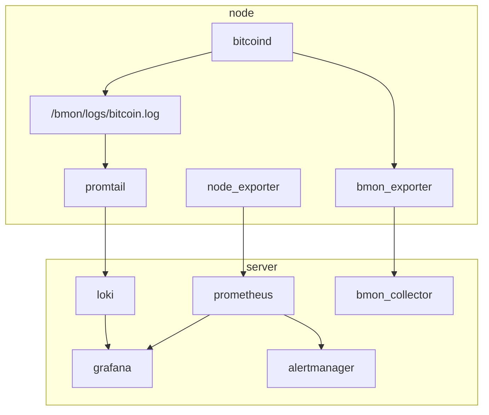

# network-monitor

A Bitcoin network monitor

## Design

Bmon consists of two machine types: one server and many nodes. The nodes run bitcoind,
and provide information to the server, which collects and synthesizes all the data
necessary. The server also provides views on the data, including log exploration,
metric presentation, and other high-level insights (TBD).

The bmon server runs

- loki, for log aggregation
- alertmanager, for alerts
- grafana, for presenting logs and metrics
- prometheus, for aggregating metrics
- [tbd] bmon_collector, which aggregates insights

Each bmon node (the analogue of a bitcoind node) runs

- bitcoind, which runs bitcoin
- promtail, which pushes logs into loki (on the server)
- node_exporter, which offers system metrics for scraping by prometheus
- bmon_exporter, which pushes interesting high-level data into 

For simplification, all servers participate in a single wireguard network.

### Node versions

- One for each major release
- One for current RC
- Maintain 3 rotating versions of master, staggered backwards by
  - 1 week
  - 4 weeks
  - 16 weeks

### Uses

- [ ] For a given block, determine when it was seen by each node. Present variance.
    Alert on anomalous variance.

- [ ] For a given transaction, determine when it was seen by each node. Present
    variance. Alert on anomalous variance.

- [ ] "Selfish mining" detector: alert on multiple blocks in rapid succession that
    cause a reorg.

### Notify on

- [ ] mempool empty
- [ ] inflation (rolling sum of UTXO amounts + (block_created_amt - block_destroyed_amt) > supply_at_height)
- [ ] tip older than 90 minutes
- [ ] transactions rejected from mempool
- [ ] bad blocks
- [ ] reorgs

### Measurements

- [ ] block reception time per node
- [ ] txn reception time per node
- [ ] reorg count (number of unused tips?)
- [ ] usual system metrics: memory usage, disk usage, CPU load, etc.

### Comparison across nodes

- [ ] mempool contents 
- [ ] getblocktemplate contents (do they differ at all?)
- [ ] block processing time (per logs)
- [ ] block reception time diff
- [ ] txn reception time diff

### Features

- [ ] logs sent to a centralized log explorer (Loki-Grafana)
