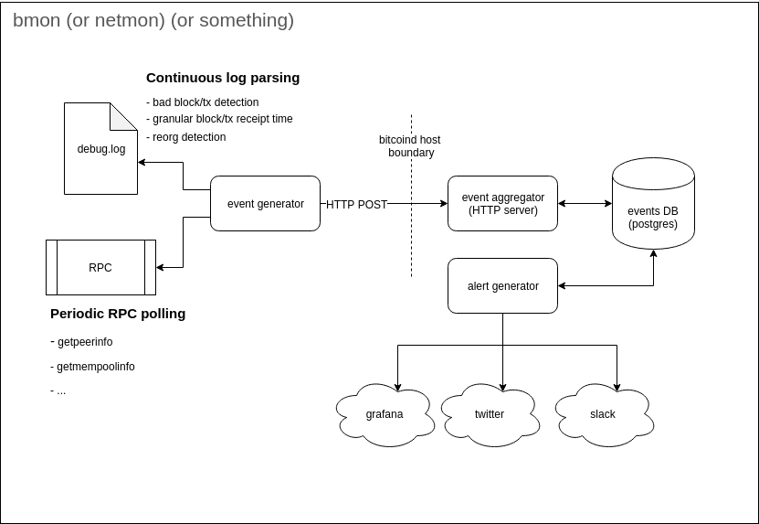

# network-monitor

A Bitcoin network monitor

## Design

Node versions:

- One for each major release
- One for current RC
- Maintain 3 rotating versions of master, staggered backwards by
  - 1 week
  - 4 weeks
  - 16 weeks

Invariants:

- [ ] mempool not empty
- [ ] tip younger than 30 minutes
- [ ] no inflation (rolling sum of UTXO amounts + (block_created_amt - block_destroyed_amt) <= supply_at_height))

Notify on:

- [ ] transactions rejected from mempool
- [ ] bad blocks
- [ ] reorgs

Measurements:

- [ ] block reception time per node
- [ ] txn reception time per node
- [ ] reorg count (number of unused tips?)
- [ ] usual system metrics: memory usage, disk usage, CPU load, etc.

Comparison across nodes:

- [ ] mempool contents (are 99.9% of all known txns shared across all mempools?)
- [ ] getblocktemplate contents (do they differ at all?)
- [ ] block processing time (per logs)
- [ ] block reception time diff
- [ ] txn reception time diff

Features:

- [ ] logs sent to a centralized log explorer (e.g. graylog2, Elasticsearch-Logstash-Kibana stack)
