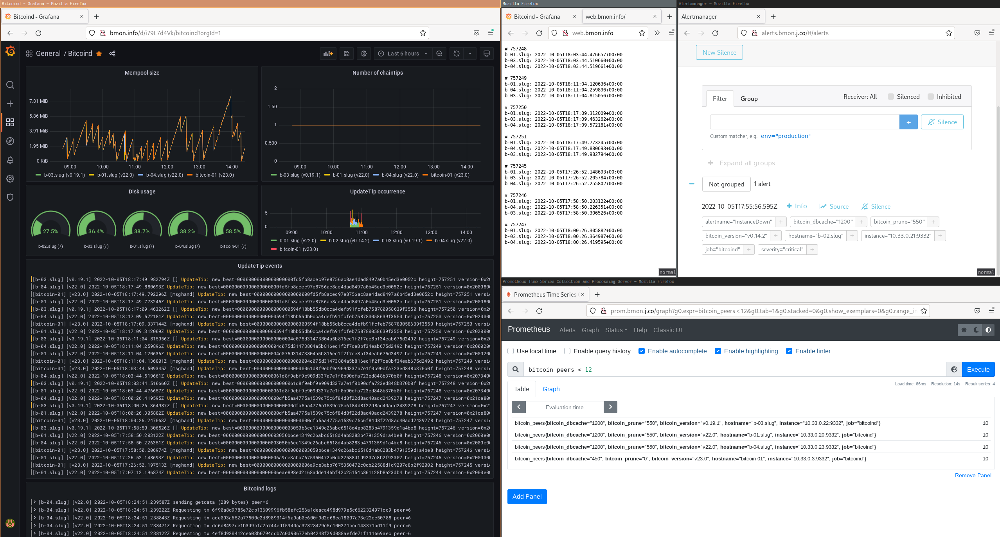

A Bitcoin network monitor



Provides log aggregation, a Grafana dashboard, automated alerting, and a framework for
doing realtime analysis (via logs and RPC) on a collection of bitcoind nodes.


## Local dev

1. Ensure you have Python 3.10+, Docker, and docker-compose on your host.
    - `pip install docker-compose`
1. Install the local infrastructure tools:
    - `pip install -e ./infra`

### Easy way

1. Bring everything up with `bmon-config && ./dev reup`

### Manual way

1. Build local config tree: `bmon-config`
1. Run the database migrations: `./dev managepy migrate`
1. Bring docker-compose up: `docker-compose up [-d]`

Then browse to `http://localhost:3000` to access Grafana; use the default admin
credentials `admin`/`admin`. You should see a nice little sample dashboard displaying
bitcoind logs etc.


## Running tests

1. `./dev test`
1. Try generating a block locally:
    - `docker-compose up -d`
    - In one terminal: `./dev watchlogs`
    - In another: `./dev generateblock`


## Important tools for investigation

### Full grep of all node logs

```sh
bmon-infra rg <query>
```

### Query redis contents

```sh
ssh some-bmon-host
cd bmon/
./dev shell
```
```python
from bmon.server_tasks import redisdb
from bmon.mempool import full_scan
full_scan(redisdb, '*<some txid>*')
```

## Adding alerts

Modify `./etc/prom-alerts.yml` and redeploy to the server with 
`bmon-infra -f bmon deploy`.

## Onboarding a new bitcoind host

1. Run `./bin/bootstrap-bitcoind` with the required arguments. If for some reason 
   the script doesn't or can't run to completion, just do the stuff that's in there
   manually - it shouldn't be hard to figure out. This will output a wireguard pubkey
   that you should use in subsequent steps.
1. Modify `wg-bmon` wireguard configuration on the serverside (the bmon administrator
   has to do this) using the bitcoind wg pubkey.
1. Generate a client wireguard peer configuration with `bmon-infra
   wireguard-peer-template <hostname>` and install it on the bitcoind host:
       ```sh
       sudo vim /etc/wireguard/wg-bmon.conf
       sudo systemctl enable --now wg-quick@wg-bmon
       ```
1. Add an entry to `./infra/hosts_prod.yml` corresponding to the desired bitcoind
   settings.
1. Update the bmon secrets store with `sudo_password` for host.
1. Test deployment to the new host
        ```sh
        bmon-infra -f new-hostname deploy
        ```
1. If that succeeds, update the server's monitoring configs etc.
        ```sh
        bmon-infra -t server deploy
        ```

And the new host should be fully online.

## Design

Bmon consists of two machine types: one server and many nodes. The nodes run bitcoind,
and provide information to the server, which collects and synthesizes all the data
necessary. The server also provides views on the data, including log exploration,
metric presentation, and other high-level insights (TBD).

The bmon server runs

- loki, for log aggregation
- alertmanager, for alerts
- grafana, for presenting logs and metrics
- prometheus, for aggregating metrics
- [tbd] bmon_collector, which aggregates insights

Each bmon node (the analogue of a bitcoind node) runs

- bitcoind, which runs bitcoin
- promtail, which pushes logs into loki (on the server)
- node_exporter, which offers system metrics for scraping by prometheus
- bmon_exporter, which pushes interesting high-level data into 


For simplification, all servers participate in a single wireguard network.

## How are hosts configured?

All known participants in bmon are listed in `./infra/hosts.yml`. This file is parsed
by `./infra/bmon_infra/infra.py` (which gets installed as the `bmon-infra`), which
then configures each host over SSH (using [fscm](https://github.com/jamesob/fscm),
which itself uses mitogen, a Python library that basically facilitates remote execution of
Python code over an SSH connection).

During provisioning, a copy of the `bmon` repo is cloned on each host at `~/bmon`,
and then `bmon-config` (`./infra/bmon_infra/config.py`) is run to generate a `.env`
file with all configuration and secrets based on the host's entry in `hosts.yml`.

The `.env` file is read in by docker-compose and used to set various parameters of the
container runtimes. The docker-compose lifecycle is managed by systemd on each host; a
user-level systemd unit is installed by the `bmon-infra` command.


## How is wireguard used?

Since monitored hosts will live on different networks, wireguard is used to create a
flat networking topology so that all hosts can be easily reached by the central bmon
server, which aggregates measurements across each host.

To add a host, file an issue here and I'll give a wireguard config to use.

Wireguard is also used to simulate geographical dispersion of the monitored nodes. A
VPN provider gives us Wireguard configurations for diverse networks, which we then use
on certain monitored bitcoind hosts.


### Node versions

- One for each major release
- One for current RC
- Maintain 3 rotating versions of master, staggered backwards by
  - 1 week
  - 4 weeks
  - 16 weeks

### Uses

- [ ] For a given block, determine when it was seen by each node. Present variance.
    Alert on anomalous variance.

- [ ] For a given transaction, determine when it was seen by each node. Present
    variance. Alert on anomalous variance.

- [ ] "Selfish mining" detector: alert on multiple blocks in rapid succession that
    cause a reorg.

### Notify on

- [ ] mempool empty
- [ ] inflation (rolling sum of UTXO amounts + (block_created_amt - block_destroyed_amt) > supply_at_height)
- [ ] tip older than 90 minutes
- [ ] transactions rejected from mempool
- [ ] bad blocks
- [ ] reorgs

### Measurements

- [ ] block reception time per node
- [ ] txn reception time per node
- [ ] reorg count (number of unused tips?)
- [ ] usual system metrics: memory usage, disk usage, CPU load, etc.

### Comparison across nodes

- [ ] mempool contents 
- [ ] getblocktemplate contents (do they differ at all?)
- [ ] block processing time (per logs)
- [ ] block reception time diff
- [ ] txn reception time diff

### Features

- [ ] logs sent to a centralized log explorer (Loki-Grafana)


### Misc.

#### Resizing existing vagrant disk

sudo cfdisk /dev/sda
sudo resize2fs -p -F /dev/sda1
